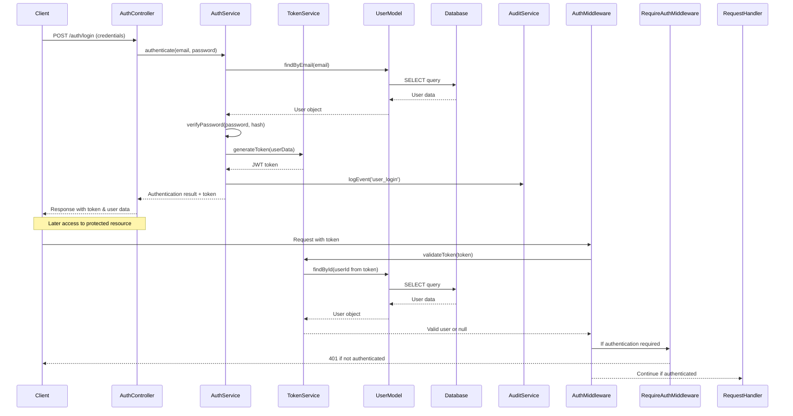

# Authentication Flow

## Overview
The CarFuse authentication system uses JWT tokens for secure API access, with refresh tokens for extended sessions. The flow is managed through multiple middleware components and services working together to validate user identity.

## Authentication Sequence Diagram

## Authentication Components

### 1. Token Service (`TokenService`)

The `TokenService` class handles JWT token generation, validation, and extraction:

- **Token Generation**: Creates secure JWT tokens with user identity and expiration
- **Token Validation**: Verifies token signatures and expiration times
- **Token Extraction**: Retrieves tokens from headers, cookies, or request parameters
- **Request Validation**: Extracts and validates tokens from incoming requests

### 2. Authentication Middleware (`AuthMiddleware`)

The `AuthMiddleware` intercepts incoming requests to validate authentication:

- Extracts authentication tokens from various sources (headers, cookies)
- Uses `TokenService` to validate token authenticity
- Retrieves user data from database for valid tokens
- Attaches user information to request attributes for downstream components
- Returns 401 Unauthorized responses for invalid tokens if authentication is required

### 3. Authentication Service (`AuthService`) 

The `AuthService` implements core authentication logic:

- User authentication with email/password
- Password verification with secure hashing
- Token generation through `TokenService`
- Audit logging of authentication events
- Password reset functionality

### 4. User Model

The `User` model provides authentication-related database operations:

- Finding users by email or ID
- Verifying credentials
- Storing password reset tokens
- Managing user account status

## Authentication Flows

### 1. Login Flow

1. Client submits credentials to `AuthController`
2. `AuthController` delegates to `AuthService` for authentication
3. `AuthService` locates user by email and verifies password hash
4. On successful authentication, `TokenService` generates a JWT token
5. `AuditService` logs the successful login event
6. Token and user details returned to client for future requests

### 2. Token Validation Flow

1. `AuthMiddleware` intercepts incoming request
2. Token extracted from request (Authorization header or cookies)
3. `TokenService` verifies token authenticity and expiration
4. If token is valid, user data is fetched from database
5. User data attached to request as an attribute
6. Request continues to target controller for processing

### 3. Password Reset Flow

1. User requests password reset via `UserController`
2. `UserController` validates email and creates a reset token
3. Reset token stored in database with expiration time
4. Email notification sent to user with reset link
5. User clicks reset link and submits new password
6. `UserController` verifies token and updates password
7. `AuditService` logs the password change event

### 4. Registration Flow

1. User submits registration data to `UserController`
2. Data validation performed by `Validator` service
3. `UserController` checks if email is already in use
4. New user created through `UserModel` (handles password hashing)
5. Welcome notification sent via `NotificationService`
6. `AuditService` logs the registration event
7. User receives confirmation response

## Security Considerations

1. **Token Security**
   - JWT tokens signed with secure algorithm
   - Short expiration times (typically 1 hour)
   - Token validation on every request

2. **Password Security**
   - Passwords hashed using bcrypt with appropriate cost factor
   - Minimum password length enforced
   - Password reset tokens expire after short period

3. **Session Management**
   - Stateless authentication using JWT
   - Session data stored in Redis for web interface
   - CSRF protection for state-changing operations

4. **Access Control**
   - Role-based authorization implemented at service layer
   - Resource-level permissions enforced
   - Context-aware authorization rules
