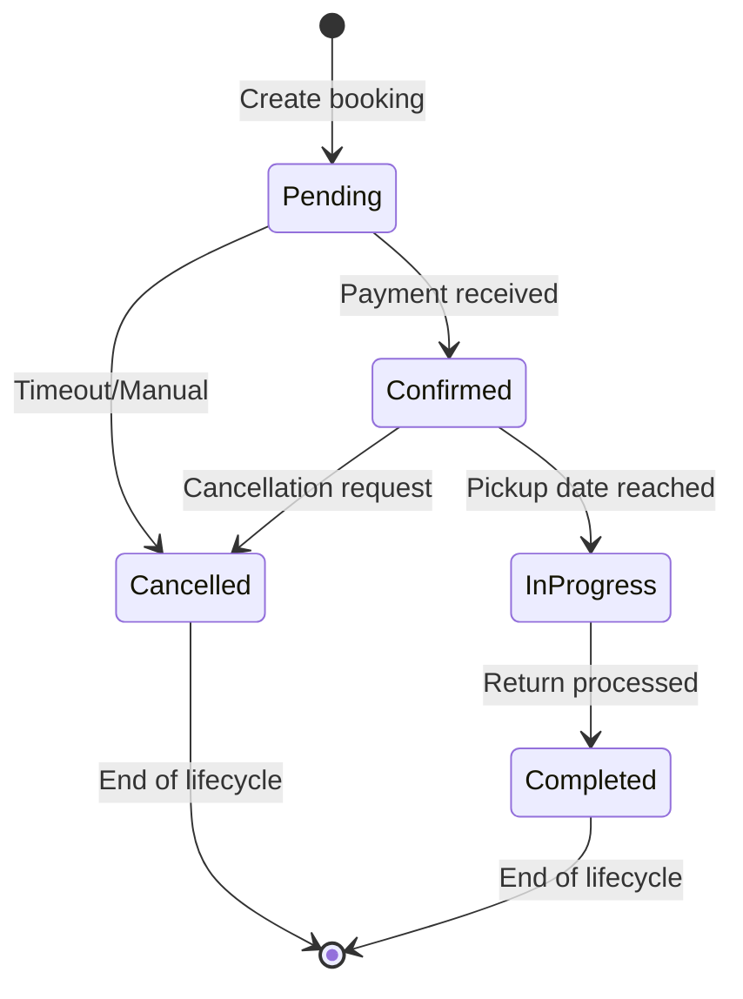

# Booking Process Flow

## Overview
The booking process in CarFuse handles the complete flow from initial API request to database storage, including validation, business logic processing, and transaction management to ensure data integrity across multiple tables.

## Booking Process Flow Diagram

```
┌──────────┐      ┌─────────────────┐      ┌─────────────────┐      ┌──────────────────┐
│  Client  │─────▶│API/BookingRoute │─────▶│CsrfMiddleware   │─────▶│AuthMiddleware    │
└──────────┘      └─────────────────┘      └─────────────────┘      └──────────────────┘
      │                     │                       │                        │
      │                     │                       │                        │
      │                     ▼                       │                        │
      │           ┌─────────────────────┐           │                        │
      │           │RequireAuthMiddleware│           │                        │
      │           └─────────────────────┘           │                        │
      │                     │                       │                        │
      │                     ▼                       │                        │
      │           ┌─────────────────────┐           │                        │
      │           │BookingController    │           │                        │
      │           └─────────────────────┘           │                        │
      │                     │                       │                        │
      │                     ▼                       │                        │
      │           ┌─────────────────────┐           │                        │
      │           │BookingService       │◀──────────┘                        │
      │           └─────────────────────┘                                    │
      │                     │                                                │
      │                     ▼                                                │
      │           ┌─────────────────────┐                                    │
      │           │Validator            │                                    │
      │           └─────────────────────┘                                    │
      │                     │                                                │
      │                     ▼                                                │
      │           ┌─────────────────────┐                                    │
      │           │AvailabilityChecker  │                                    │
      │           └─────────────────────┘                                    │
      │                     │                                                │
      │                     ▼                                                │
      │           ┌─────────────────────┐         ┌──────────────────┐       │
      │           │DatabaseHelper       │━━━━━━━━▶│Database          │       │
      │           │(Transaction)        │◀━━━━━━━━│(Multiple Tables) │       │
      │           └─────────────────────┘         └──────────────────┘       │
      │                     │                                                │
      │                     ▼                                                │
      │           ┌─────────────────────┐                                    │
      │           │NotificationService  │                                    │
      │           └─────────────────────┘                                    │
      │                     │                                                │
      │                     ▼                                                │
      │           ┌─────────────────────┐                                    │
      │           │AuditService         │◀───────────────────────────────────┘
      │           └─────────────────────┘
      │                     │
      ▼                     ▼
┌──────────┐      ┌─────────────────┐
│  Client  │◀─────│JSON Response    │
└──────────┘      └─────────────────┘
```

## Booking Process Stages

### 1. Request Processing and Authentication
- Client sends booking request with vehicle, dates, and options
- Request passes through middleware chain:
  - CsrfMiddleware validates CSRF token for form submission security
  - AuthMiddleware authenticates the user making the request
  - RequireAuthMiddleware ensures user is authenticated
- User identity and CSRF validation confirmed before processing

### 2. Controller and Request Validation
- BookingController receives the request
- Extracts and organizes booking parameters
- Passes data to BookingService for business logic handling
- Validator component performs comprehensive validation:
  - Required fields presence
  - Date format and logic (start before end)
  - Vehicle availability during requested period
  - User booking permissions and limits

### 3. Business Logic Processing
- BookingService performs core business operations:
  - Price calculation based on duration, vehicle, and options
  - Discount application if applicable
  - Availability confirmation via AvailabilityChecker
  - Insurance and additional options processing

### 4. Database Transaction
- DatabaseHelper initiates a transaction to ensure data integrity
- Multiple tables are updated in a single transaction:
  - `bookings`: Core booking record
  - `booking_options`: Selected add-ons and extras
  - `vehicle_availability`: Vehicle status updates
  - `user_bookings`: User-booking relationship

### 5. Post-Booking Processes
- Contract generation via DocumentService
- Confirmation notifications through NotificationService
- Audit logging via AuditService
- Payment processing through PaymentService

### 6. Response Handling
- Success response returned to client with booking details
- Error responses include validation errors or system issues

## Booking State Transitions



### State Transition Rules

1. **Pending to Confirmed**
   - Triggered by successful payment
   - Requires vehicle availability confirmation
   - Generates rental contract

2. **Pending to Cancelled**
   - Triggered by user cancellation or timeout
   - No financial impact if cancelled within grace period
   - Releases vehicle availability

3. **Confirmed to Cancelled**
   - Requires cancellation request processing
   - May trigger refund calculation
   - Notification sent to user

4. **Confirmed to InProgress**
   - Automatic transition on pickup date
   - Updates vehicle status to "in use"
   - Triggers pickup notification

5. **InProgress to Completed**
   - Triggered by vehicle return processing
   - Updates vehicle status to "available"
   - May trigger additional charges if applicable

## Booking-Related Notifications

1. **Booking Confirmation**
   - Sent immediately after successful booking
   - Includes booking reference, dates, vehicle details
   - Contains payment receipt if applicable

2. **Booking Cancellation**
   - Sent when booking is cancelled
   - Includes refund information if applicable
   - May contain rebooking options

3. **Booking Modification**
   - Sent when booking details change
   - Highlights changes (dates, vehicle, options)
   - May include price adjustment details

4. **Pickup Reminder**
   - Sent before scheduled pickup date
   - Includes location, time, required documents
   - Contact information for assistance

5. **Return Reminder**
   - Sent before scheduled return date
   - Includes return location and time
   - Return process instructions
````
