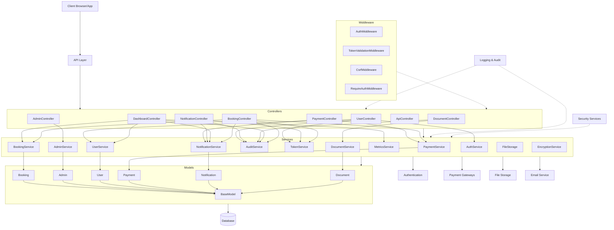
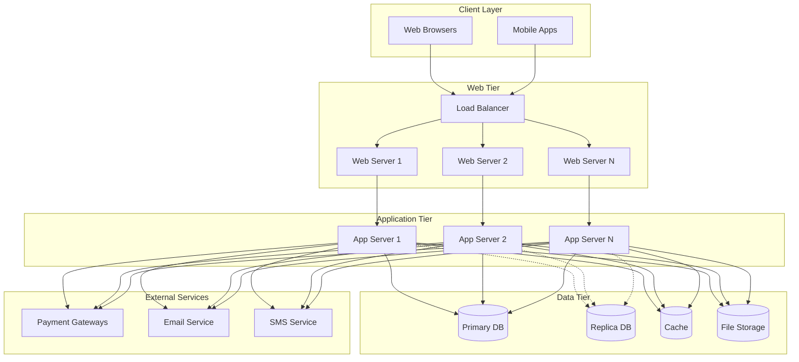

# Architecture Overview

## Introduction
CarFuse is a comprehensive car rental management system built with a modern PHP stack, following clean architecture principles. The system features modular design with clear separation of concerns, dependency injection, and comprehensive error handling to ensure reliability and maintainability.

## System Architecture Diagram

```
┌──────────────────────────────────────────────────────────────┐
│                        Client Layer                          │
│  ┌──────────────┐  ┌──────────────┐  ┌──────────────────┐    │
│  │  Web Browser │  │  Mobile App  │  │  API Consumers   │    │
│  └──────────────┘  └──────────────┘  └──────────────────┘    │
└──────────────────────────────────────────────────────────────┘
                          │
                          ▼
┌──────────────────────────────────────────────────────────────┐
│                     Presentation Layer                       │
│  ┌──────────────┐  ┌──────────────┐  ┌──────────────────┐    │
│  │   Views      │  │  Templates   │  │  API Responses   │    │
│  └──────────────┘  └──────────────┘  └──────────────────┘    │
└──────────────────────────────────────────────────────────────┘
                          │
                          ▼
┌──────────────────────────────────────────────────────────────┐
│                        Web Layer                             │
│  ┌──────────────┐  ┌──────────────┐  ┌──────────────────┐    │
│  │   Routes     │  │  Middleware  │  │   Controllers    │    │
│  └──────────────┘  └──────────────┘  └──────────────────┘    │
└──────────────────────────────────────────────────────────────┘
                          │
                          ▼
┌──────────────────────────────────────────────────────────────┐
│                     Application Layer                        │
│  ┌──────────────┐  ┌──────────────┐  ┌──────────────────┐    │
│  │   Services   │  │  Validators  │  │ Event Handlers   │    │
│  └──────────────┘  └──────────────┘  └──────────────────┘    │
└──────────────────────────────────────────────────────────────┘
                          │
                          ▼
┌──────────────────────────────────────────────────────────────┐
│                      Domain Layer                            │
│  ┌──────────────┐  ┌──────────────┐  ┌──────────────────┐    │
│  │    Models    │  │Business Rules│  │  Domain Events   │    │
│  └──────────────┘  └──────────────┘  └──────────────────┘    │
└──────────────────────────────────────────────────────────────┘
                          │
                          ▼
┌──────────────────────────────────────────────────────────────┐
│                  Infrastructure Layer                        │
│  ┌──────────────┐  ┌──────────────┐  ┌──────────────────┐    │
│  │  Database    │  │External APIs │  │    File Storage  │    │
│  └──────────────┘  └──────────────┘  └──────────────────┘    │
└──────────────────────────────────────────────────────────────┘
```

## System Component Diagram



## System Components

### 1. Presentation Layer
- **Views**: HTML templates for web interface
- **Templates**: Reusable UI components 
- **API Responses**: Structured JSON responses for API clients

### 2. Web Layer
- **Routes**: URL mapping to controllers using routing system
- **Middleware**: Request/response processing pipeline including:
  - Authentication (JWT, session)
  - Authorization
  - Input validation
  - CSRF protection
  - Session management
  - HTMX request handling
- **Controllers**: Handle HTTP requests, delegate to services, return responses

### 3. Application Layer
- **Services**: Core business logic implementation with specialized services for:
  - Authentication and user management
  - Booking processing
  - Payment handling
  - Reporting and analytics
  - Document generation
  - Notification delivery
- **Validators**: Input validation and sanitization
- **Event Handlers**: Process system events and trigger side effects

### 4. Domain Layer
- **Models**: Data structures representing business entities
- **Business Rules**: Domain-specific logic and constraints
- **Domain Events**: Event-driven communication within the domain

### 5. Infrastructure Layer
- **Database Access**: Database connection and query management
- **External API Clients**: Integration with third-party services
- **File Storage**: Document and image storage management
- **Caching**: Performance optimization through data caching

### 6. Cross-Cutting Concerns
- **Logging**: Comprehensive application logging
- **Error Handling**: Centralized exception management
- **Audit Trail**: Security and compliance auditing
- **Configuration**: Environment-specific settings

## Technology Stack

### Backend
- **Language**: PHP 8.1+
- **Framework**: Custom MVC framework with PSR-compatible components
- **Database**: MySQL 8.0 for relational data
- **Caching**: Redis for performance optimization
- **Session Storage**: Redis for distributed session management
- **API Format**: JSON over HTTP/HTTPS
- **Authentication**: JWT for API authentication, session-based for web interface

### Frontend
- **Template Engine**: PHP templates with HTMX for dynamic content
- **CSS Framework**: Tailwind CSS
- **JavaScript**: Alpine.js for minimal interactivity
- **AJAX**: HTMX for server-side rendering with partial page updates

### Infrastructure
- **Web Server**: Nginx serving PHP-FPM
- **Deployment**: Docker containerization
- **Monitoring**: ELK Stack (Elasticsearch, Logstash, Kibana)
- **CI/CD**: GitHub Actions for automated testing and deployment

## Design Patterns

The CarFuse architecture implements several key design patterns:

1. **Model-View-Controller (MVC)**
   - Separation of data (Models), presentation (Views), and logic (Controllers)
   - Controllers focus on request/response handling and delegate business logic to Services
   - Models represent database entities and encapsulate data access logic

2. **Service Layer**
   - Business logic encapsulated in dedicated service classes
   - Services as the primary API for controllers
   - Clear service boundaries with dedicated responsibilities (e.g., PaymentService, BookingService)
   - Service composition through constructor dependency injection

3. **Repository Pattern**
   - Data access abstracted through repositories
   - Models interact with databases via DatabaseHelper
   - Consistent database operations through BaseModel inheritance hierarchy

4. **Dependency Injection**
   - Services and dependencies injected through constructors
   - Reduced coupling between components
   - Enables easier testing through component substitution
   - Type-hinted properties with PHP 8.1 features

5. **Middleware Pipeline**
   - Request processing through sequential middleware components
   - Each middleware handles a specific cross-cutting concern
   - Authentication and authorization handled by AuthMiddleware and TokenValidationMiddleware
   - CSRF protection implemented as middleware

6. **Factory Pattern**
   - Object creation centralized in factory classes
   - Complex object initialization encapsulated
   - Used for document generation, payment processing implementations

7. **Facade Pattern**
   - Complex subsystems hidden behind simpler interfaces
   - `PaymentService` acts as facade for payment processing, refunds, and transactions
   - `DocumentService` abstracts document storage, encryption, and template rendering

8. **Observer Pattern** 
   - Event system for loose coupling between components
   - Audit logging implemented as observers to system events
   - Notification system triggered by booking and payment events

## Security Architecture

The CarFuse system implements multiple layers of security:

1. **Authentication**
   - Multi-factor authentication support
   - JWT-based API authentication
   - Session-based web authentication
   - Secure password storage with bcrypt

2. **Authorization**
   - Role-based access control
   - Resource-level permissions
   - Context-aware authorization rules

3. **Data Protection**
   - Encryption for sensitive data at rest
   - TLS for data in transit
   - PCI DSS compliance for payment processing

4. **Attack Prevention**
   - CSRF protection for state-changing operations
   - Input validation and sanitization
   - Rate limiting for authentication attempts
   - IP-based blocking for suspicious activity

5. **Audit and Compliance**
   - Comprehensive audit logging
   - User activity tracking
   - Change history for sensitive operations

## Scalability Considerations

The architecture supports horizontal scaling through:

1. **Stateless design** where possible
2. **Distributed session management**
3. **Database connection pooling**
4. **Caching at multiple levels**
5. **Asynchronous processing** for non-critical operations

## Development Workflow

1. **Local Development**
   - Docker-based local environment
   - Hot reloading for rapid iteration
   - Local database seeding

2. **Testing**
   - Unit tests for individual components
   - Integration tests for component interactions
   - End-to-end tests for critical user flows

3. **Deployment**
   - Staging environment for pre-release validation
   - Blue-green deployment for zero-downtime updates
   - Automated rollback capability

## Monitoring and Observability

The system includes comprehensive monitoring:

1. **Application Performance Monitoring**
2. **Error tracking and alerting**
3. **User experience monitoring**
4. **Security event monitoring**
5. **Business metrics dashboard**

## Documentation

System documentation is maintained in multiple formats:

1. **Architecture documentation** (this document)
2. **API documentation** with OpenAPI/Swagger
3. **Code documentation** with PHPDoc
4. **User documentation** for end-users

## Layered Architecture

CarFuse implements a layered architecture that promotes separation of concerns, maintainability, and testability:

1. **Presentation Layer**
   - Controllers handle HTTP requests and responses
   - Views (HTML templates) render UI elements
   - API endpoints expose functionality to clients
   - HTMX integration for dynamic UI updates

2. **Application Layer**
   - Services implement business logic and workflows
   - Cross-cutting concerns (logging, security) managed here
   - Transaction boundaries defined at this level
   - Services coordinate between controllers and data access

3. **Domain Layer**
   - Models represent business entities and relationships
   - Business rules and domain validation 
   - Data structure definitions
   - Entity relationships and domain events

4. **Infrastructure Layer**
   - Database access and connection management
   - External service integration (payment gateways, file storage)
   - System configuration and environment handling
   - Caching and performance optimizations

## Design Patterns Employed

The CarFuse system leverages several design patterns to maintain clean architecture:

1. **Dependency Injection**
   - Services and dependencies injected where needed
   - Reduces coupling between components
   - Improves testability through mock objects
   - Used consistently across all services and controllers

2. **Repository Pattern**
   - Models encapsulate data access logic
   - Abstract database operations behind consistent interfaces
   - Allow for database technology changes with minimal impact

3. **Factory Pattern**
   - Object creation centralized in factory classes
   - Complex object initialization encapsulated
   - Used for document generation, payment processing, etc.

4. **Facade Pattern**
   - Complex subsystems hidden behind simpler interfaces
   - `PaymentService` acts as facade for multiple payment-related services
   - `AuditService` acts as facade for different types of auditing

5. **Observer Pattern** 
   - Event system for loose coupling between components
   - Subscribers respond to system events
   - Used for notifications and logging

6. **Middleware Pipeline**
   - Request processing through sequential middleware components
   - Each middleware handles a specific cross-cutting concern
   - Clean separation of authentication, encryption, and other concerns

## System Boundaries and Integration Points

### External Boundaries

1. **Payment Gateways**
   - Integration with multiple payment providers (Stripe, PayPal, etc.)
   - Webhook handlers for asynchronous payment events
   - Secure credential management for payment APIs

2. **File Storage Systems**
   - Local filesystem and cloud storage (S3) integration
   - Secure document storage and retrieval
   - Encryption of sensitive documents

3. **Email and SMS Providers**
   - Integration with email delivery services
   - SMS notification gateways
   - Template-based message generation

4. **Authentication Providers**
   - JWT token generation and validation
   - Integration with OAuth providers (if applicable)
   - Session management and security controls

### Internal Boundaries

1. **Service Boundaries**
   - Well-defined service interfaces
   - Clear separation between service domains
   - Minimal dependencies between services

2. **Data Access Boundaries**
   - Models control access to database
   - Services do not directly access database
   - Consistent transaction management

## Scalability Considerations

The architecture supports horizontal scaling through:

1. **Stateless Design**
   - No session state stored in application memory
   - JWT tokens enable stateless authentication
   - Enables deployment across multiple servers

2. **Distributed Session Management**
   - Session data stored in shared storage
   - Supports load balancing without sticky sessions
   - Session security maintained across distributed environment

3. **Database Optimization**
   - Connection pooling for efficient resource usage
   - Query optimization and proper indexing
   - Database access abstraction for potential sharding

4. **Caching Strategy**
   - Multi-level caching (application, object, query)
   - Cache invalidation mechanisms
   - Response caching for frequently accessed content

5. **Asynchronous Processing**
   - Long-running tasks handled asynchronously
   - Background processing for reports and notifications
   - Enables better resource utilization

## Deployment Architecture

### Infrastructure Components



### Deployment Considerations

1. **Containerization**
   - Application components containerized for consistency
   - Orchestration with Kubernetes or similar technology
   - Container registry for versioned deployments

2. **Environment Separation**
   - Development, staging, and production environments
   - Configuration isolation between environments
   - Feature flags for controlled feature rollout

3. **Security Measures**
   - Network segmentation and security groups
   - TLS encryption for all communications
   - Regular security scans and penetration testing
   - Secrets management for sensitive configuration

4. **Monitoring and Observability**
   - Centralized logging infrastructure
   - Performance monitoring and alerting
   - Error tracking and reporting
   - Business metrics dashboards

5. **Disaster Recovery**
   - Database backups and point-in-time recovery
   - Multi-region deployment capabilities
   - Defined recovery procedures and failover mechanisms
