# Service Interactions

## Overview
How services interact with each other.

## Service Dependencies
Dependencies between services.

## Communication Patterns
Patterns used for service communication.

## Error Handling
How errors are handled between services.

## Service Dependency Diagram

```mermaid
graph TD
    %% Controllers
    UserC[UserController]
    PaymentC[PaymentController]
    NotificationC[NotificationController]
    DocumentC[DocumentController]
    DashboardC[DashboardController]
    BookingC[BookingController]
    AdminC[AdminController]

    %% Core Services
    PaymentS[PaymentService]
    BookingS[BookingService]
    NotificationS[NotificationService]
    DocumentS[DocumentService]
    UserS[UserService]
    AdminS[AdminService]
    MetricsS[MetricsService]
    AuditS[AuditService]

    %% Authentication Services
    AuthS[AuthService]
    TokenS[TokenService]

    %% Utility Services
    ValidatorS[Validator]
    LoggerS[LoggerInterface]
    ExHandler[ExceptionHandler]
    FileS[FileStorage]
    EncryptS[EncryptionService]
    TemplateS[TemplateService]
    
    %% Payment Subsystem
    PayProcS[PaymentProcessingService]
    RefundS[RefundService]
    PayGatewayS[PaymentGatewayService]
    TransS[TransactionService]

    %% Controller Dependencies
    UserC --> AuthS
    UserC --> TokenS
    UserC --> ValidatorS
    UserC --> UserS
    UserC --> AuditS
    UserC --> ExHandler
    UserC --> LoggerS

    PaymentC --> PaymentS
    PaymentC --> ValidatorS
    PaymentC --> NotificationS
    PaymentC --> ExHandler
    PaymentC --> LoggerS

    NotificationC --> NotificationS
    NotificationC --> TokenS
    NotificationC --> AuditS
    NotificationC --> ExHandler
    NotificationC --> LoggerS

    DocumentC --> DocumentS
    DocumentC --> ValidatorS
    DocumentC --> AuditS
    DocumentC --> ExHandler
    DocumentC --> LoggerS

    DashboardC --> BookingS
    DashboardC --> MetricsS
    DashboardC --> NotificationS
    DashboardC --> UserS
    DashboardC --> AuditS
    DashboardC --> ExHandler
    DashboardC --> LoggerS

    BookingC --> BookingS
    BookingC --> PaymentS
    BookingC --> ValidatorS
    BookingC --> AuditS
    BookingC --> NotificationS
    BookingC --> TokenS
    BookingC --> ExHandler
    BookingC --> LoggerS

    AdminC --> AdminS
    AdminC --> ExHandler
    AdminC --> LoggerS

    %% Service Dependencies
    PaymentS --> PayProcS
    PaymentS --> RefundS
    PaymentS --> PayGatewayS
    PaymentS --> TransS
    PaymentS --> AuditS

    BookingS --> ValidatorS
    BookingS --> AuditS
    BookingS --> LoggerS

    NotificationS --> LoggerS
    NotificationS --> AuditS

    DocumentS --> LoggerS
    DocumentS --> ExHandler
    DocumentS --> AuditS
    DocumentS --> FileS
    DocumentS --> EncryptS
    DocumentS --> TemplateS

    AdminS --> AuditS
    AdminS --> LoggerS
    AdminS --> TokenS
    AdminS --> ExHandler

    %% Authentication Dependencies
    AuthS --> TokenS
    AuthS --> AuditS
    AuthS --> LoggerS
```



## Service Responsibility Matrix

| Service | Primary Responsibility | Dependencies | Transaction Boundaries |
|---------|------------------------|--------------|------------------------|
| PaymentService | Payment processing facade | PaymentProcessingService, RefundService, PaymentGatewayService, TransactionService | No direct transactions |
| BookingService | Booking management | Validator, AuditService | Manages booking transactions |
| NotificationService | User notifications | EmailService, SMSService | No transactions |
| DocumentService | Document generation & management | FileStorage, EncryptionService, TemplateService | File operations transactions |
| UserService | User account management | AuthService, AuditService | User data transactions |
| AdminService | Admin operations | Admin model, AuditService | Administrative transactions |
| AuditService | Event logging | LoggerInterface | Audit log transactions |
| TokenService | JWT token management | - | No transactions |
| AuthService | Authentication logic | TokenService, UserService | No transactions |

## Service Initialization Pattern

The system uses constructor dependency injection throughout:

```php
class BookingController extends Controller
{
    private BookingService $bookingService;
    private PaymentService $paymentService;
    private Validator $validator;
    private AuditService $auditService;
    private NotificationService $notificationService;
    private ResponseFactoryInterface $responseFactory;
    protected LoggerInterface $logger;
    private TokenService $tokenService;
    protected ExceptionHandler $exceptionHandler;

    public function __construct(
        LoggerInterface $logger,
        BookingService $bookingService,
        PaymentService $paymentService,
        Validator $validator,
        AuditService $auditService,
        NotificationService $notificationService,
        ResponseFactoryInterface $responseFactory,
        TokenService $tokenService,
        ExceptionHandler $exceptionHandler
    ) {
        parent::__construct($logger, $exceptionHandler);
        $this->bookingService = $bookingService;
        $this->paymentService = $paymentService;
        $this->validator = $validator;
        $this->auditService = $auditService;
        $this->notificationService = $notificationService;
        $this->responseFactory = $responseFactory;
        $this->tokenService = $tokenService;
        $this->exceptionHandler = $exceptionHandler;
    }
    // ...
}
```

This pattern ensures:
- Clear dependency declaration through type hints
- Testability via dependency substitution
- Consistent service lifecycle management
- Separation of concerns
- Reduced coupling between components

## Service Communication Patterns

### 1. Direct Method Invocation

The primary communication pattern is direct method calls between services:

```php
// BookingController calling BookingService
$result = $this->bookingService->createBooking($data);

// BookingService calling NotificationService
$this->notificationService->sendBookingConfirmation($bookingId, $userId);
```

### 2. Event-Based Communication

Cross-cutting concerns like auditing use event-based communication:

```php
// Services trigger audit events
$this->auditService->logEvent(
    'booking_created',
    "New booking created",
    ['booking_id' => $bookingId, 'user_id' => $userId]
);
```

### 3. Facade Pattern

Complex subsystems are accessed through facade services:

```php
// PaymentService acts as a facade for payment subsystem
class PaymentService
{
    private PaymentProcessingService $paymentProcessingService;
    private RefundService $refundService;
    private PaymentGatewayService $paymentGatewayService;
    private TransactionService $transactionService;
    
    // Methods delegate to specialized services
    public function processPayment(array $data) {
        return $this->paymentProcessingService->processPayment($data);
    }
    
    public function refundPayment(array $data) {
        return $this->refundService->processRefund($data);
    }
}
```

## Transaction Boundaries

### 1. Service-Level Transactions

Transaction boundaries are typically defined at the service layer:

```php
// PaymentProcessingService transaction example
public function processPayment(array $paymentData): array
{
    // Pre-transaction validation
    $fraudCheckResult = $this->performFraudValidation($paymentData);
    if (!$fraudCheckResult['valid']) {
        // Handle fraud detection
        return ['error' => 'Payment rejected due to security concerns'];
    }
    
    // Begin transaction
    $this->dbHelper->beginTransaction();
    try {
        // Multiple database operations
        $paymentId = $this->paymentModel->create($paymentData);
        $this->bookingModel->updateStatus($paymentData['booking_id'], 'confirmed');
        $this->transactionLogModel->create([
            'payment_id' => $paymentId,
            'type' => 'payment',
            'amount' => $paymentData['amount']
        ]);
        
        // Commit if all operations succeed
        $this->dbHelper->commit();
        
        // Post-transaction operations (not part of transaction)
        $this->auditService->logEvent('payment_processed', 'Payment processed successfully');
        
        return ['success' => true, 'payment_id' => $paymentId];
    } catch (Exception $e) {
        // Rollback on error
        $this->dbHelper->rollback();
        $this->logger->error('Payment processing failed: ' . $e->getMessage());
        throw $e;
    }
}
```

### 2. Model-Level Transactions

Some complex model operations also manage transactions:

```php
public function transferFunds(int $fromAccountId, int $toAccountId, float $amount): bool
{
    $this->dbHelper->beginTransaction();
    try {
        // Debit one account
        $this->update($fromAccountId, ['balance' => new RawExpr('balance - :amount')], [':amount' => $amount]);
        
        // Credit another account
        $this->update($toAccountId, ['balance' => new RawExpr('balance + :amount')], [':amount' => $amount]);
        
        // Create transfer record
        $this->transferModel->create([
            'from_account_id' => $fromAccountId,
            'to_account_id' => $toAccountId,
            'amount' => $amount,
            'timestamp' => date('Y-m-d H:i:s')
        ]);
        
        $this->dbHelper->commit();
        return true;
    } catch (Exception $e) {
        $this->dbHelper->rollback();
        $this->logger->error('Fund transfer failed: ' . $e->getMessage());
        return false;
    }
}
```

## Error Handling and Propagation

### 1. Exception Handling Pattern

```php
try {
    // Operation that might fail
    $result = $this->someService->riskyOperation();
    
    // Process result if successful
    return $this->success('Operation completed', $result);
} catch (\Exception $e) {
    // Log and handle exception
    $this->exceptionHandler->handleException($e);
    
    // Return error response
    return $this->error('Operation failed', [], 500);
}
```

### 2. Centralized Exception Handler

The `ExceptionHandler` provides consistent exception processing:

```php
public function handleException(\Exception $e): void 
{
    // Log the exception with context
    $this->logger->error($e->getMessage(), [
        'exception' => get_class($e),
        'file' => $e->getFile(),
        'line' => $e->getLine(),
        'trace' => $e->getTraceAsString()
    ]);
    
    // Handle different exception types
    if ($e instanceof DatabaseException) {
        // Handle database errors
    } else if ($e instanceof ValidationException) {
        // Handle validation errors
    } else if ($e instanceof AuthenticationException) {
        // Handle authentication errors
    }
    
    // Record critical errors in monitoring system
    if ($this->isProductionEnvironment() && $this->isCriticalException($e)) {
        $this->alertingService->sendAlert([
            'type' => 'exception',
            'message' => $e->getMessage(),
            'severity' => 'critical'
        ]);
    }
}
```

### 3. Domain-Specific Exceptions

Services throw domain-specific exceptions for better error handling:

```php
// In a service
if (!$this->vehicleModel->isAvailable($vehicleId, $startDate, $endDate)) {
    throw new VehicleNotAvailableException(
        "Vehicle #$vehicleId is not available for the requested dates"
    );
}
```

## Service Discovery and Configuration

The system uses dependency injection for service discovery and configuration:

### 1. Service Container

A dependency injection container manages service instantiation and resolution:

```php
// Container configuration
$container->set(LoggerInterface::class, function() {
    return new Logger('app');
});

$container->set(DatabaseHelper::class, function($c) {
    return new DatabaseHelper(
        $c->get('db.host'),
        $c->get('db.name'),
        $c->get('db.user'),
        $c->get('db.pass')
    );
});

$container->set(AuditService::class, function($c) {
    return new AuditService(
        $c->get(LoggerInterface::class),
        $c->get(DatabaseHelper::class)
    );
});

// Service resolution
$auditService = $container->get(AuditService::class);
```

### 2. Configuration Management

Services access configuration through dependency injection:

```php
class DocumentService 
{
    private array $config;
    
    public function __construct(
        // ...other dependencies...
        array $config
    ) {
        // ...
        $this->config = $config;
    }
    
    public function generateContract(int $bookingId, int $userId): string
    {
        // Use configuration
        $filename = str_replace(
            ['{booking_id}', '{timestamp}'], 
            [$bookingId, time()], 
            $this->config['naming']['contract_format']
        );
        
        $filePath = $this->fileStorage->storeFile(
            $this->config['storage']['contracts'], 
            $filename,
            $encryptedContract
        );
        
        // ...
    }
}
```

## Cross-Cutting Concerns

### 1. Logging

Consistent logging throughout all services:

```php
$this->logger->info("Processing payment", [
    'payment_id' => $paymentId,
    'amount' => $paymentData['amount'],
    'user_id' => $paymentData['user_id']
]);

$this->logger->error("Payment gateway error", [
    'code' => $errorResponse['code'],
    'message' => $errorResponse['message'],
    'payment_id' => $paymentId
]);
```

### 2. Audit Logging

Standardized audit trail generation:

```php
$this->auditService->logEvent(
    'booking_rescheduled',
    "Booking #{$id} rescheduled",
    [
        'booking_id' => $id,
        'user_id' => $user['id'],
        'new_pickup' => $data['pickup_date'],
        'new_dropoff' => $data['dropoff_date']
    ],
    $user['id'],
    $id,
    'booking'
);
```

### 3. Authentication and Authorization

Consistent security checks:

```php
// In middleware
$user = $this->tokenService->validateRequest($request);
if (!$user) {
    return $response->withStatus(401);
}

// In services
if (!$this->bookingService->validateBookingAccess($bookingId, $userId)) {
    throw new AccessDeniedException("User does not have access to this booking");
}
```
