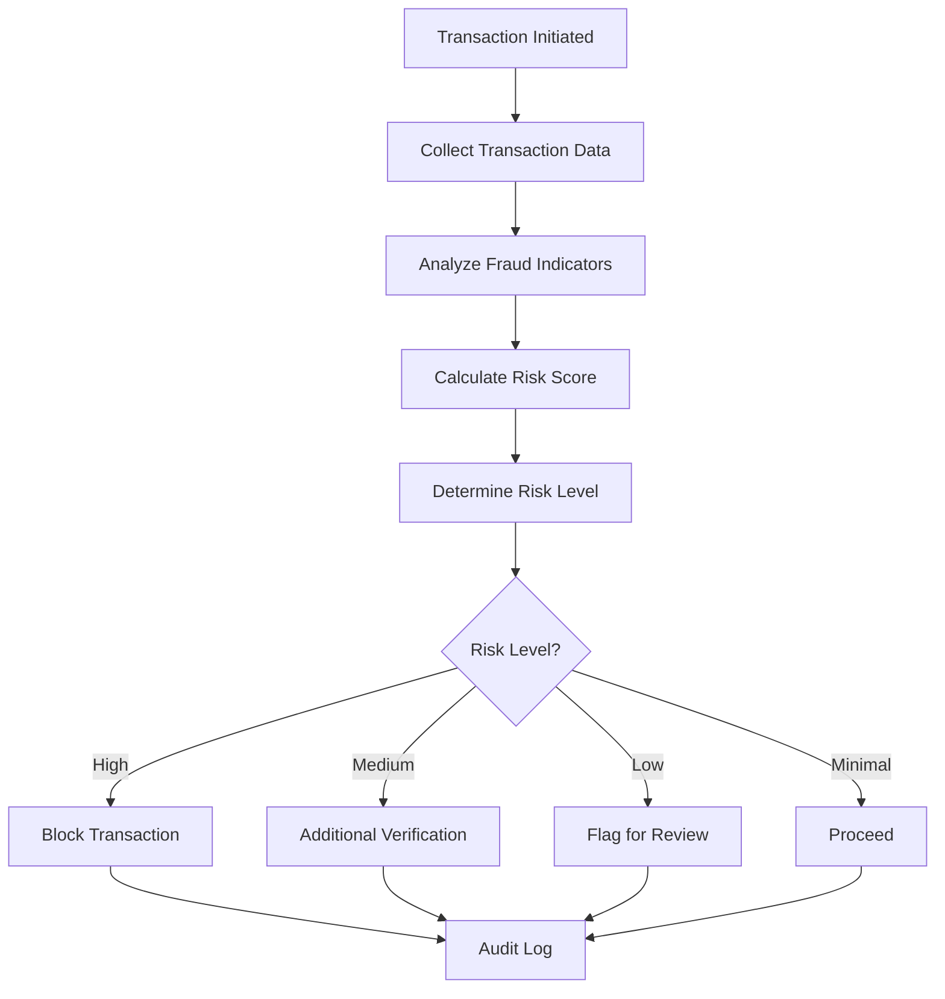

# Fraud Detection System Documentation

## Overview

The CarFuse fraud detection system is a sophisticated risk assessment engine that analyzes transactions in real-time to identify potential fraud. The system employs a multi-factor scoring approach to quantify risk and provide appropriate recommendations based on configurable thresholds.

## Fraud Detection Methodology

### Risk Assessment Model

The system uses a weighted indicator model where each potential risk factor contributes to an overall risk score. When a transaction is processed:

1. Transaction data is analyzed against multiple fraud indicators
2. Each detected indicator adds points to the risk score based on its weight
3. The final risk score determines the risk level (high, medium, low, minimal)
4. Appropriate action is recommended based on risk level

### Process Flow

## Risk Scoring Factors and Thresholds

### Risk Thresholds

The system classifies risk into four levels based on configurable thresholds:

| Risk Level | Default Threshold |
|------------|------------------|
| High       | ≥ 70             |
| Medium     | ≥ 50             |
| Low        | ≥ 30             |
| Minimal    | < 30             |

### Fraud Indicators and Weights

The following indicators contribute to the risk score:

| Indicator              | Weight | Description                                        |
|------------------------|--------|----------------------------------------------------|
| High amount            | 15     | Transaction amount exceeds configured threshold    |
| Multiple attempts      | 20     | User made multiple payment attempts                |
| Unusual location       | 30     | Transaction location differs from expected         |
| Address mismatch       | 25     | Billing and shipping addresses don't match         |
| Card country mismatch  | 35     | Card country differs from user's country           |
| Rapid transactions     | 18     | Multiple transactions in short time period         |
| Unusual time           | 10     | Transaction outside normal business hours          |
| IP proxy detected      | 40     | User appears to be using proxy/VPN                 |
| Device mismatch        | 28     | User using different device than previous sessions |
| Risky email domain     | 15     | Email from domain associated with temporary emails |

*Note: Weights can be configured in the system settings to adjust sensitivity.*

## Automated Actions for Suspicious Activities

### Risk-Based Recommendations

The system automatically recommends different actions based on the calculated risk level:

| Risk Level | Default Recommendation | Description                                         |
|------------|------------------------|-----------------------------------------------------|
| High       | block_transaction      | Prevent transaction from completing                 |
| Medium     | additional_verification| Request additional identity verification from user  |
| Low        | flag_for_review        | Allow transaction but mark for manual review        |
| Minimal    | proceed                | Allow transaction to complete normally              |

### Special Case Rules

Certain indicators trigger specific recommendations regardless of the overall risk score:

- IP proxy detection always triggers additional verification
- Card country mismatch triggers blocking for high risk or verification for other risk levels

## Manual Review Process

### Review Workflow

Transactions flagged for review appear in the admin dashboard with:

1. Complete transaction details
2. List of triggered fraud indicators
3. Risk score and level
4. User history summary
5. Action buttons for approve/deny/verify

### Investigation Guidelines

When manually reviewing flagged transactions:

1. **Verify user identity**: Check against known customer data
2. **Review transaction history**: Look for patterns or anomalies
3. **Assess contextual factors**: Consider time, amount, and location context
4. **Contact customer**: For medium-high risk levels, verify via secure channels
5. **Document decision**: Record justification for approval or rejection

## System Integration

### Integration with Payment Processing

The fraud detection system integrates with the payment processing pipeline:

1. `PaymentProcessingService` calls fraud detection before processing payments
2. Risk assessment results determine if payment proceeds or is rejected
3. Fraudulent transactions are logged and can trigger security alerts

### Audit Trail

All fraud detection activities are logged for security and compliance:

1. TransactionAuditService records all fraud validation results
2. High risk transactions generate security alerts
3. Detection results are stored in the audit database for reporting
4. Fraud patterns can be analyzed through the security dashboard

## Configuration and Tuning

The system is configurable through `/App/Config/fraud_detection.php` to adjust:

- Risk thresholds for different risk levels
- Indicator weights for scoring
- Rule parameters (e.g. amount thresholds, time windows)
- Risky email domain list
- Custom rules for specific business needs

*Regular review of fraud detection effectiveness is recommended to tune parameters according to evolving fraud patterns.*

## Security Considerations

- Keep fraud detection rules confidential to prevent circumvention
- Regularly review and update detection rules based on new fraud patterns
- Ensure proper access controls for manual review systems
- Monitor and audit all changes to fraud detection configuration
